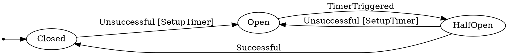

# rust-fsm-graph
Statemachine graph generator for state machines defined using the DSL of the [rust-fsm-dsl crate](https://crates.io/crates/rust-fsm-dsl).

# Howto

Assuming you have a rust source code file containing the [example state machine](https://github.com/eugene-babichenko/rust-fsm#using-the-dsl-for-defining-state-machines) from the rust-fsm documentation in a file called example.rs, run:

```sh
$ cargo run example.rs
Wrote CircuitBreaker.dot
```

This produces a [graphviz](https://graphviz.org/) .dot file which can be rendered to images in a plethora of formats - png, svg, ps, pdf etc. In this example, it produces a `CircuitBreaker.dot` file:

.. which using the `dot -Tpng CircuitBreaker.dot > CircuitBreaker.png` command from the graphviz package generates the following image:


